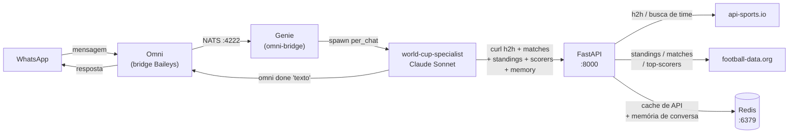
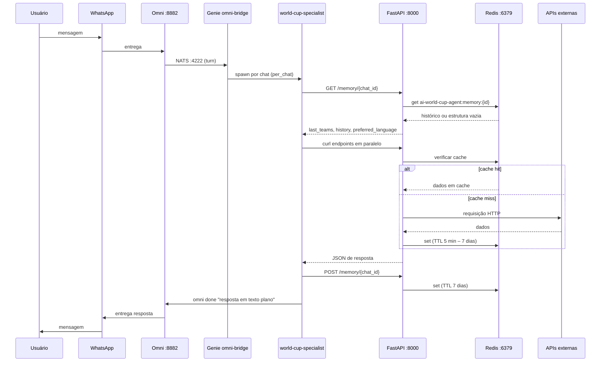
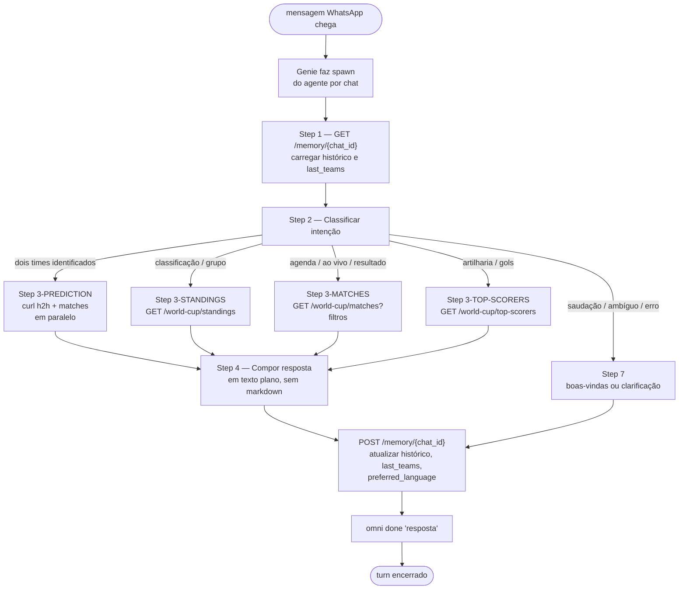

# AI World Cup — Agente de Previsões de Futebol

Agente para WhatsApp que responde perguntas sobre a Copa do Mundo FIFA 2026.
Recebe mensagens via Omni, processa com Claude via Genie e responde com previsões, classificação, agenda e artilharia baseadas em dados em tempo real.

---

## Arquitetura



### Fluxo de uma mensagem ponta-a-ponta



### Ciclo de vida do agente (por turn)



### Stack

| Camada        | Componente               | Função                                           |
| ------------- | ------------------------ | ------------------------------------------------ |
| Canal         | Omni + Baileys           | Bridge WhatsApp, roteamento NATS (:4222)         |
| Orquestração  | Genie v4                 | Ciclo de vida do agente, inbox, turns            |
| IA            | Claude Sonnet            | NLU, geração de previsões e respostas            |
| Dados         | FastAPI + api-sports.io  | Histórico de confrontos diretos (h2h)            |
| Dados (Copa)  | football-data.org        | Classificação, agenda, resultados, artilharia    |
| Memória       | Redis + FastAPI /memory  | Histórico de conversa por chat (TTL 7 dias)      |
| Cache         | Redis (opcional)         | Cache das respostas das APIs externas            |

### Decisões arquiteturais

**1. Agente chama FastAPI via curl, não importação direta**
O agente é um processo Claude Code com acesso ao bash. Chama
`curl http://localhost:8000/...` para buscar dados. Isso mantém agente e API
independentemente reiniciáveis com contrato HTTP limpo.

**2. Sem subscriber NATS no FastAPI**
O Omni + Genie gerenciam o roteamento via NATS nativamente. Adicionar um subscriber
na API criaria dois consumidores concorrentes e acoplaria a camada de dados ao
transporte do agente.

**3. Modo turn-based no Omni**
Cada mensagem WhatsApp é um turn Omni. O agente lê o contexto, processa e fecha com
`omni done "texto"`. Modelo correto para Q&A: uma mensagem entra, uma sai.

**4. Respostas apenas em texto plano**
O WhatsApp renderiza `*`, `**` e `#` como caracteres literais. Todas as respostas
são texto plano sem markdown — enforçado no `AGENTS.md`.

**5. Memória por conversa no Redis via FastAPI**
Cada remetente WhatsApp tem um registro no Redis com chave
`ai-world-cup-agent:memory:{chatId}` (TTL 7 dias). O agente faz
`GET /memory/{chatId}` no início de cada turn para carregar histórico e
`POST /memory/{chatId}` após responder para persistir. Armazena os últimos 10
turnos (20 entradas), `last_teams` (últimos dois times discutidos) e
`preferred_language`. Isso permite o usuário perguntar "e o jogo mais recente
deles?" sem repetir os nomes dos times.

**6. Cache com decorator próprio e `redis.asyncio`**
`app/utils/cache.py` implementa um decorator `@cache(ttl=..., key_builder=...)`
usando `redis.asyncio` diretamente. TTLs por endpoint: 7 dias (busca de time),
24h (h2h), 5 min (standings e matches), 10 min (top-scorers), 60s (matches
ao vivo). Se o Redis não estiver disponível (`REDIS_HOST` ausente), o decorator
simplesmente não cacheia — sem erro, sem dependência obrigatória.

**7. FastAPI como processo local, não container**
O docker-compose sobe apenas o Redis. O uvicorn roda diretamente no venv via
`make start`. Evita conflito de porta e simplifica o ciclo de debug.

---

## Configuração

### Pré-requisitos

- Python 3.10+
- Docker (para o Redis)
- Genie CLI v4: instalado em `~/.local/bin/genie`
- Omni CLI v2: instalado em `~/.bun/bin/omni`
- Chave de API do [api-sports.io](https://api-sports.io) (obrigatória)
- Chave de API do [football-data.org](https://www.football-data.org) (opcional)

### Setup (uma vez)

```bash
make install
```

Verifica dependências, inicializa submódulos, cria o venv Python, instala pacotes
e gera o `.env`.

Após o script, preencha o `.env`:

```env
FOOTBALL_IO_SPORTS_API_KEY=sua_chave_api_sports_io
OMNI_API_KEY=sua_chave_omni          # omni config show
```

### Variáveis de ambiente

| Variável                      | Obrigatória | Descrição                                                          |
| ----------------------------- | ----------- | ------------------------------------------------------------------ |
| `FOOTBALL_IO_SPORTS_API_KEY`  | Sim         | Chave para api-sports.io (h2h e busca de time)                     |
| `FOOTBALL_DATA_ORG_API_KEY`   | Não         | Chave para football-data.org (standings, matches, scorers)         |
| `OMNI_API_KEY`                | Sim         | Chave de autenticação do Omni (`omni config show`)                 |
| `OMNI_API_URL`                | Não         | URL base do Omni (padrão: `http://localhost:8882`)                 |
| `API_BASE_URL`                | Não         | URL da FastAPI usada pelo agente (padrão: `http://localhost:8000`) |
| `REDIS_HOST`                  | Não         | Host do Redis (cache e memória em memória se ausente)              |
| `REDIS_PORT`                  | Não         | Porta do Redis (padrão: `6379`)                                    |
| `REDIS_PASSWORD`              | Não         | Senha do Redis (padrão: vazio para Redis local)                    |

---

## Execução

### Subir tudo (um comando)

```bash
make start
```

Idempotente. Sobe Redis (Docker), Omni, genie serve (+ omni-bridge) e FastAPI
(uvicorn) **e já conecta o agente ao Omni**. Rodar de novo não cria duplicatas —
cada etapa checa o estado antes de agir. Ao final imprime o `make status`.

> **WhatsApp ainda não conectado?** Na primeira vez (nenhuma instância Omni existente),
> `make start` cria automaticamente uma instância e exibe o QR code no terminal.
> Escaneie com o celular (WhatsApp → Dispositivos Vinculados → Vincular dispositivo)
> e rode `make start` novamente para confirmar a conexão.
>
> Se precisar rever o QR de uma instância existente:
> ```bash
> omni instances list          # obter <instance-id>
> omni instances qr <instance-id>
> ```

O agente responde **sob demanda**: quando chega uma mensagem no WhatsApp, o
`omni-bridge` faz spawn de um agente por-chat (`per_chat`) usando a mensagem como
prompt. Não é preciso manter um processo "master" ocioso.

### Conferir o estado

```bash
make status
```

Saúde de cada serviço, o agente conectado e avisos de acúmulo (registros Omni
antigos ou sessões órfãs).

### Limpar lixo acumulado (opcional)

```bash
make clean
```

Colapsa registros de agente Omni duplicados para 1 e encerra sessões órfãs.

### Sessão de debug (opcional)

```bash
make agent-spawn   # sessão manual do agente para inspeção
```

### Parar / reiniciar

```bash
make stop
make restart
```

### Atualizar as instruções do agente

O prompt do agente é o `AGENTS.md` — um único arquivo que contém o loop de turn
completo (Steps 1–8), persona e princípios. Como aplicar uma edição depende do que
mudou:

- **Mudou a FastAPI** (novo endpoint que o agente já chama): o agente faz `curl`
  em runtime a cada turn, então pega automático. Basta `make restart` (ou reiniciar
  a API). O chat atual usa na hora — sem reset.

- **Mudou as instruções** (`AGENTS.md`): uma conversa **nova** já nasce com o prompt
  atual. Mas um chat **já ativo** mantém o prompt velho. Para forçar o reload:

  ```bash
  make reload-agent   # genie dir sync + reset das sessões do bridge
  ```

  A próxima mensagem de cada chat spawna fresh e lê as instruções novas. A memória
  da conversa (Redis) **não** é apagada.

> `make sync-agent` faz só o `dir sync` (vale para conversas novas, sem mexer nas
> ativas). `make reload-agent` é o que aplica a mudança aos chats já em andamento.

---

## Referência de comandos

| Comando             | O que faz                                                          |
| ------------------- | ------------------------------------------------------------------ |
| `make install`      | Verifica deps, submódulos, cria venv, instala pacotes, gera `.env` |
| `make start`        | Sobe todos os serviços **e** conecta o agente (idempotente)        |
| `make status`       | Snapshot de saúde; sinaliza acúmulo                                |
| `make stop`         | Para todos os serviços + encerra sessões do agente                 |
| `make restart`      | `stop` + `start`                                                   |
| `make register`     | Só a conexão Genie ↔ Omni (idempotente; alias `make wire`)         |
| `make clean`        | Remove registros Omni duplicados + sessões órfãs (destrutivo)      |
| `make sync-agent`   | `genie dir sync` (instruções para conversas novas)                 |
| `make reload-agent` | Aplica instruções editadas a TODOS os chats (reset de sessão)      |
| `make agent-spawn`  | Sessão manual de debug (opcional)                                  |
| `make test`         | Roda a suite de testes                                             |

---

## Referência da API

Documentação interativa: `http://localhost:8000/docs`

### `GET /football/head-to-head`

Histórico de confrontos diretos entre dois times.

Query: `?name_team_a=Brazil&name_team_b=France`

```json
{
  "matchup": "Brazil vs France",
  "total_matches": 14,
  "historical_stats": {
    "team_a_wins": 6,
    "team_b_wins": 4,
    "draws": 4,
    "team_a_goals_scored": 18,
    "team_b_goals_scored": 14
  },
  "recent_encounters": [
    { "date": "2022-12-10", "competition": "FIFA World Cup", "score": "France 1 - 0 Brazil" }
  ]
}
```

### `GET /football/world-cup/standings`

Classificação por grupos da Copa 2026 (fonte: football-data.org).

```json
{
  "groups": [
    {
      "group": "A",
      "standings": [
        { "position": 1, "team": "Brazil", "played": 3, "won": 2, "draw": 1,
          "lost": 0, "goals_for": 5, "goals_against": 2, "goal_difference": 3, "points": 7 }
      ]
    }
  ]
}
```

### `GET /football/world-cup/matches`

Agenda, resultados e partidas ao vivo.

Query params (todos opcionais):

| Parâmetro   | Tipo           | Exemplo                 | Descrição                               |
| ----------- | -------------- | ----------------------- | --------------------------------------- |
| `teams`     | string (multi) | `?teams=Brazil`         | Filtra por nome de time (repetível)     |
| `date_from` | date           | `?date_from=2026-06-20` | Data inicial (deve vir com `date_to`)   |
| `date_to`   | date           | `?date_to=2026-06-20`   | Data final (deve vir com `date_from`)   |
| `status`    | enum           | `?status=IN_PLAY`       | `SCHEDULED`, `IN_PLAY`, `PAUSED`, `FINISHED` |

```json
{
  "matches": [
    { "utc_date": "2026-06-20T18:00:00Z", "home_team": "Brazil",
      "away_team": "France", "score": { "home": 2, "away": 1 },
      "status": "FINISHED", "stage": "Group Stage" }
  ]
}
```

### `GET /football/world-cup/top-scorers`

Artilheiros da Copa 2026.

```json
{
  "scorers": [
    { "position": 1, "player": "Vinicius Jr.", "team": "Brazil", "goals": 4, "assists": 2 }
  ]
}
```

### `GET /memory/{chat_id}`

Carrega o histórico de conversa de um chat.

```json
{
  "chat_id": "5511999999999@s.whatsapp.net",
  "last_teams": ["Brazil", "Argentina"],
  "preferred_language": "pt",
  "history": [
    { "role": "user", "text": "Brasil x Argentina quem ganha?", "ts": "2026-06-20T15:00:00" },
    { "role": "agent", "text": "Historicamente...", "ts": "2026-06-20T15:00:01" }
  ]
}
```

### `POST /memory/{chat_id}`

Salva um turno de conversa. Body JSON:

| Campo                | Tipo   | Obrigatório | Descrição                          |
| -------------------- | ------ | ----------- | ---------------------------------- |
| `user_msg`           | string | Sim         | Mensagem do usuário                |
| `agent_rep`          | string | Sim         | Resposta do agente                 |
| `team_a`             | string | Não         | Primeiro time (para `last_teams`)  |
| `team_b`             | string | Não         | Segundo time (para `last_teams`)   |
| `preferred_language` | string | Não         | Idioma detectado (`"pt"`, `"en"`)  |

---

## Testes

```bash
make test
# ou: python -m pytest -v tests/
```

Cobertura em 8 arquivos: serviço h2h, serviço world-cup, controller h2h,
controller world-cup, controller memory, rotas, integração api-sports.io e
integração football-data.org. Todos os testes usam mocks — nenhuma chamada
real à API externa.

---

## Arquivos do agente

| Arquivo                                       | Função                                                                   |
| --------------------------------------------- | ------------------------------------------------------------------------ |
| `agents/world-cup-specialist/AGENTS.md`       | Prompt completo: loop de turn (Steps 1–8), persona, princípios e constraints. Arquivo único, sem imports externos. |
| `agents/world-cup-specialist/agent.yaml`      | Config do Genie: `model: sonnet`, `promptMode: append`                   |
| `scripts/setup.sh`                            | Install idempotente (`make install`)                                     |
| `scripts/register-agent.sh`                   | Conexão Genie ↔ Omni idempotente (`make wire`)                           |
| `scripts/start-genie.sh`                      | Sobe genie serve + garante postgres (:5432)                              |
| `scripts/reload-agent.sh`                     | Reset de sessões (`make reload-agent`)                                   |
| `scripts/status.sh` · `stop.sh` · `clean.sh` | Ciclo de vida (`make status` / `stop` / `clean`)                         |
| `scripts/common.sh`                           | Helpers e probes compartilhados (portas, health checks)                  |

---

## Deploy

Consulte [DEPLOY.md](DEPLOY.md) para as opções de implantação: Oracle Cloud
Always Free (recomendado), VPS único, cloud+local separados e local+ngrok para
demos rápidas.
